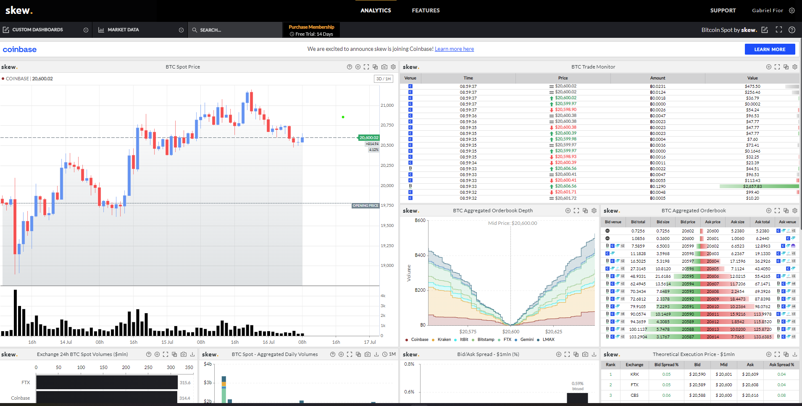

## Serum analytics

Goal - Serum analytics tools: E.g. Skew but for Serum.


https://analytics.skew.com/dashboard/bitcoin-spot (Need to create free account)


Tasks:
- Fetching data
  - Bids and asks for every market
  - Fetch continously
  - Store in DB (maybe Redis, maybe Postgres online)
- Plotting (use Streamlit + https://github.com/matplotlib/mplfinance#usage)

=================
### Connecting to DB
```
import sqlalchemy
import load_dotenv
import os

load_dotenv('./env')
engine = sqlalchemy.create_engine(os.environ['db_url'])
```